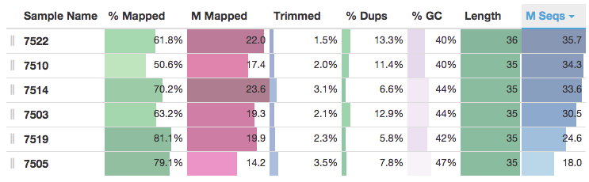
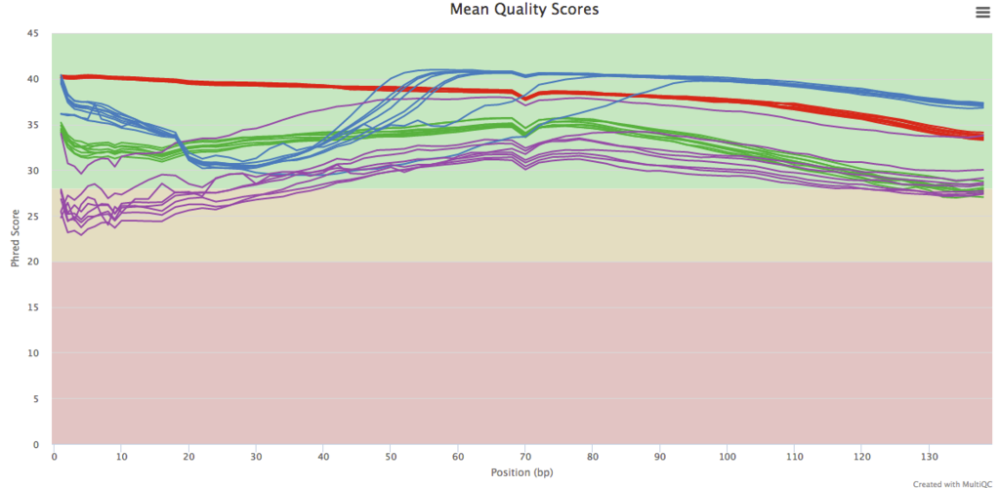

# MultiQC: Summary Analysis Reports

Philip Ewels, Måns Magnusson, Max Käller.

## Abstract
As large scale genomics studies become more common, fast and accurate quality control is increasingly important. Here, we describe MultiQC: a tool to summarize key metrics across all samples in a project into a single report. A modular design allows MultiQC to work with multiple analysis types. Templating and process triggers provide a framework for simple extension and customization. Reports enable a fast overview of the entire analysis and highlight anomalous samples and problematic steps.

## Introduction
Advances in next-generation sequencing are leading to an avalanche of data. Whilst opening doors to new analysis types and experimental designs, this provides a challenge for bioinformaticians. The sheer volume of data associated with a typical project requires high throughput processing and analysis, often yielding vast numbers of log files and quality metrics. As sample numbers increase, quality control assessment is critical. Large numbers of samples increases the chance of error and sample swaps - the earlier such mistakes can be detected the better. This leads to the complex and time consuming task of checking multiple statistics through numerous reports and log files for every sample.

MultiQC addresses this problem by searching an analysis directory for any recognized content and creating a single summary report. It is a general use tool, designed to parse log files and create plots with overlaid data. This provides the researcher with a fast method to scan all key statistics for a project quickly and easily. Additionally, shared plots allow accurate comparison between samples which is not possible when switching between different reports.

## Installation and Usage
MultiQC is a Python package available on the Python Package Index (PyPI) and GitHub. It can be installed on the command line using the common pip package, with the command `pip install multiqc`. MultiQC is compatible with Python 2.7+ and Python 3.2+, and has a small number of Python package dependencies, which should be automatically installed by pip. A graphical interface is available for Mac OS X users, which can be downloaded from GitHub. Users of Galaxy and BaseSpace can find MultiQC available as an app.

Once installed, MultiQC can be run on the command line with the command `multiqc <analysis directory>`. This searches the specified path recursively for any recognized log files, and compiles a report. Reports are interactive web pages, viewable with any modern web browser. They are also saved as zip files for easy sharing. Parsed data is saved as tab delimited text files within the report directory for downstream use.

Due to the modular design of MultiQC, it is run in the same manner for any analysis type. Each module will run only if it's log files are present, meaning that no configuration is required. At the time of writing, MultiQC comes with modules to parse logs from a range of tools including FastQC, FastQ Screen, Cutadapt, Bowtie 1/2, STAR, Tophat, Bismark, Picard and others. It is hoped that this library will expand rapidly with help from the community.

```
├── multiqc_report.html				# MultiQC Report
├── report_data						# Tab-delimited data files
│   ├── multiqc_cutadapt.txt
│   ├── multiqc_fastqc.txt
│   ├── multiqc_featureCounts.txt
│   ├── multiqc_general_stats.txt
│   └── multiqc_star.txt
└── assets							# Report assets (CSS, JavaScript, images)

```
_Fig 1. Typical output from MultiQC_

## Report Tools
Within the MultiQC report there are a number of features to aid interpretation and usage. Modules add columns to a shared 'General Statistics' table at the top of the report, allowing the analysis progression to be easily quantified (Fig 2). Automated visualisation of these numbers and tools for sorting and sample ordering allows fast identification of patterns and sample groupings.


_Fig 2. General Statistics table, showing progression of samples through analysis pipeline._

Plots showing data from each module are generated using the HighCharts JavaScript library [1]. They are resizable and interactive, some with click and drag zooming. Plots can be exported in a range of formats, including png, svg and pdf.

MultiQC reports also have a 'Toolbox'. Samples can be highlighted using search strings, optionally using regular expressions, to easily visualize groups within plots. A similar interface allows sample renaming, with a bulk option so that sample names can be pasted from a spreadsheet. Samples can also be temporarily hidden from the report. Changes can be saved for the report or set as defaults for all reports. Settings can also be saved as a file so that they can be shared with others.

A step by step tour is available in all reports to familiarize new users with the available features.


_Fig 3. Mean sequence quality across reads, from FastQC. Samples coloured by highlighting tool._


## Customization and Extension
To generate the reports, MultiQC uses the Jinja2 template framework (as used by Django and others). Multiple templates can be created and be chosen using the `-t` flag. This method allows simple customization of report output, including branding and / or additional features.

MultiQC requires one module for every tool or type of output it should recognize. Inevitably, some users will want MultiQC to work with programs which are not yet recognized. To facilitate this, MultiQC has been designed as a framework with an object-orientated class based structure, facilitating easy extension. Typically, a new module will use a base class function to find relevant log files, it will parse these with a custom set of regular expressions, and then pass these data to set of base class plotting functions. Such plots will be compatible with the report tools described above. If greater customization is required, a similar library of JavaScript functions is provided, or completely bespoke code can be used. All helper code is thoroughly described in the documentation, with examples.

It is hoped that users will contribute new modules back to the core distribution using a GitHub pull request. However, if modules or templates are too niche to be of use to others, code can be developed in an add-on Python package. This style of extension allows separate code tracking, keeping code simple and making maintenance easy. An example of such an approach can be seen in the MultiQC_NGI GitHub repository.

## Help and Availability
You can find report examples, usage tutorials and documentation at http://multiqc.info. Feature requests and bug reports should be submitted to https://github.com/ewels/MultiQC/issues

MultiQC comes with a MIT license, allowing virtually any downstream customization with attribution. It is available on GitHub at https://github.com/ewels/MultiQC and in the Python Package Index at https://pypi.python.org/pypi/multiqc

### Author Contributions
PE wrote the pacakge and the manuscript. MM helped with reorganising code within the package to make it clearer. MK directed the research group.

### Acknowledgements
The authors would like to thank Guillermo Carrasco, Robin Andeer, Johannes Alneberg and Remi Ohlsson for useful discussion. Guillermo Carrasco was responsible for the first version of the Qualimap module.

### References
[1] http://www.highcharts.com/